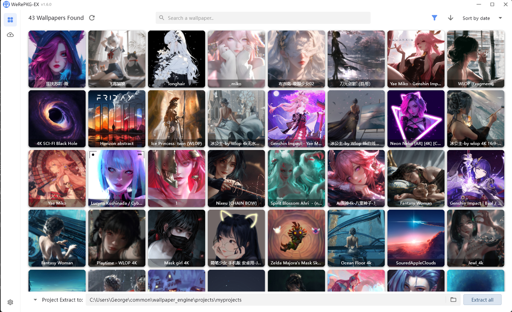
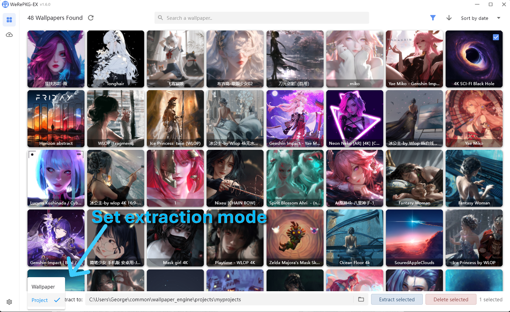
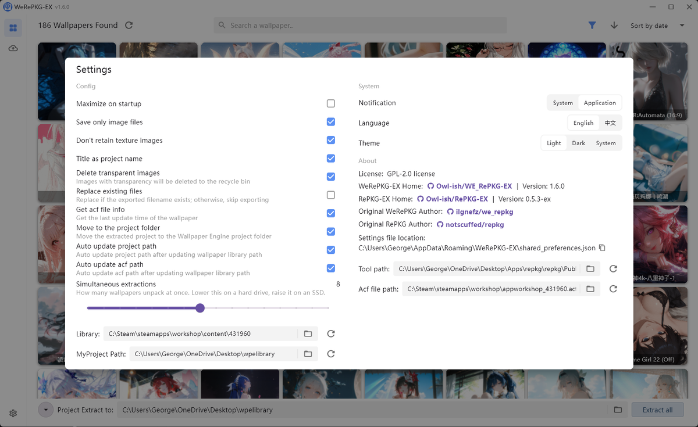

  <h3>把 Wallpaper Engine 的壁纸提取回普通文件</h3>

  <a href="https://github.com/Owl-ish/WE_RePKG-EX/releases">下载</a>
  ·
  <a href="CHANGELOG.md">更新日志</a>
  ·
  <a href="README.md">English</a>

Wallpaper Engine 把场景壁纸打包在 `scene.pkg` 里，所以订阅到的图片和视频并不是
能直接打开的文件。WeRePKG-EX 负责把它们解出来：指向你的壁纸库，选中想要的，
再把画面导出成 PNG、JPG、GIF 或 MP4。

这是一个 Windows 桌面程序，基于 [RePKG-EX](https://github.com/Owl-ish/RePKG-EX)，
并且已经内置了解包器，不需要另外安装任何东西。

## 快速上手

1. 下载最新的发行版，解压到任意位置。
2. 运行 `WeRePKG-EX.exe`。
3. 程序会自动找到 Wallpaper Engine 壁纸库。如果找错了，在设置里改路径即可。

程序不会写入你的壁纸库，提取过程只读。

## 查找壁纸

可以按名称搜索，按类型和年龄分级过滤，也可以按日期、大小或更新时间排序。
左上角的数字是当前匹配的数量。选择方式和文件管理器一致，包括按住拖动框选多个。

## 壁纸卡片

双击，或者右键选择「详情」。可以看到完整预览、简介、标签、文件大小，
以及它在硬盘上的位置。

## 提取

左下角的开关决定你得到什么：

**壁纸**：只要画面。图片会放在同一个文件夹里，可以直接当普通壁纸用，
特效遮罩和着色器文件会被跳过。

**项目**：得到完整的壁纸文件夹，Wallpaper Engine 可以重新导入，
场景结构保持完整，还能在编辑器里继续改。

两种模式都可以只处理一张，或者处理所有选中的壁纸。右键菜单里两个选项都有，
底部的按钮则作用于当前显示的全部壁纸。

批量提取时会同时处理多张壁纸。提取过程中会显示进度，也可以中途取消，
不会留下写了一半的文件。

## 设置

几个值得注意的选项：

- **仅保存图片文件**：丢掉着色器、模型和音频，只留下画面。
- **删除透明图片**：把完全透明的 PNG 移到回收站，这类图通常是遮罩而不是画面。
- **同时提取数量**：一次解包多少张壁纸。机械硬盘调低，固态硬盘可以调高。
- **移动到项目文件夹**：提取完的项目直接放进 Wallpaper Engine，能在里面看到。
- **主题**和**语言**默认跟随系统。中文和 English 在全部界面都可用。

设置文件保存在 `%APPDATA%\WeRePKG-EX`，具体路径在「关于」里可以看到。

## 致谢

本项目 fork 自 **ilgnefz** 的 [WeRePKG](https://github.com/ilgnefz/we_repkg)，
后者基于 **notscuffed** 的 [RePKG](https://github.com/notscuffed/repkg)。
内置的解包器是 [RePKG-EX](https://github.com/Owl-ish/RePKG-EX)，
同样 fork 自 notscuffed 的项目。

## License

[GPL-2.0](LICENSE)
